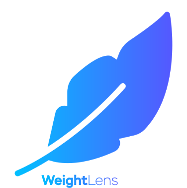

# WeightLens - A Visual Studio Code Extension for CSS Specificity Analysis

## Overview

WeightLens is a Visual Studio Code extension designed to help developers analyze CSS specificity weights within their stylesheets. Gain insights into the specificity of your selectors and optimize your styles more efficiently.

## Features

- **Specificity Analysis:** Understand the specificity weights of CSS selectors in real-time.
- **Interactive Interface:** Visualize and explore specificity information using an interactive UI.
- **Details Page:** Dive deeper into detailed information about CSS specificity.

## Installation

1. Open Visual Studio Code.
2. Go to the Extensions view (`Ctrl + Shift + X` or `Cmd + Shift + X` on Mac).
3. Search for "WeightLens" and click "Install."

## Usage

- Open a CSS file in Visual Studio Code.
- Use the `Show Details Page` command to explore specificity details.

## Commands

- **Show Details Page:** Open the detailed view for CSS specificity analysis.

## Known Issues

No known issues at the moment. If you encounter any problems, please [report them](link-to-issue-tracker).

## Contributing

If you would like to contribute to WeightLens, please follow our [contribution guidelines](link-to-contributing-guidelines).

## License

This extension is licensed under the [MIT License](LICENSE).

---
